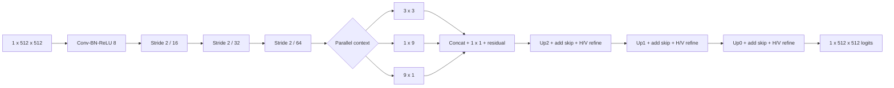

# MARS

MARS is a lightweight **M**orphology-**A**ware **R**FI **S**egmentation network
for mask-guided mitigation in radio-astronomy filterbank data. The neural model
predicts a full-resolution RFI mask; a separate GPU pipeline applies that mask,
removes the baseline, and writes an 8-bit cleaned filterbank.

This repository is a paper-aligned extraction from the historical
`Physics-Informed-Latent-Diffusion` development tree. The diffusion experiments,
versioned scratch directories, personal paths, and large generated data are not
part of the public MARS implementation.

> **Reproducibility status:** the source now contains one unambiguous paper
> configuration and guards the reported 270,769-parameter architecture. The
> audited development tree did **not** contain the final checkpoint, training
> arrays, fixed-seed benchmark manifests, TensorRT engine, or paper result
> tables. Exact numerical reproduction remains blocked until those artifacts are
> published. See [reproducibility status](docs/reproducibility.md) and the
> [paper/code audit](docs/paper-code-differences.md).

## Architecture

The paper model uses channels `(8, 16, 32, 64)`, additive U-Net skips, a
`3x3 / 1x9 / 9x1` morphology-aware bottleneck, and horizontal plus vertical
refinement at all three decoder scales.



`build_paper_model()` and the training/pipeline configs assert **270,769
trainable parameters** so a no-refinement ablation cannot silently be presented
as the paper model. Checkpoints also carry an experiment ID and SHA-256 training-
config fingerprint, which distinguishes loss-only ablations with the same
topology and parameter count.

## Install

Python 3.10 or newer is required. Install only the part you need:

```bash
python -m pip install -e .
python -m pip install -e ".[filterbank]"   # SIGPROC filterbank I/O
python -m pip install -e ".[plots,test]"  # figures and tests
```

TensorRT is intentionally not a portable base dependency. The audited
development environment used Python 3.13, PyTorch 2.11, CUDA 13, and TensorRT
10.15; the paper itself does not specify these versions. The focused version
list is in
[`environments/requirements-paper.txt`](environments/requirements-paper.txt).

## Train the paper model

Prepare the four arrays described in [`data/README.md`](data/README.md), then:

```bash
mars-train --config configs/train/paper.json
```

Controlled loss/architecture ablations use explicit delta configs:

```bash
mars-train --config configs/train/no_astro.json
mars-train --config configs/train/no_horizontal_refinement.json
mars-train --config configs/train/no_vertical_refinement.json
mars-train --config configs/train/no_decoder_refinement.json
```

Each delta has a distinct experiment identity and output directory. Modifying a
paper-locked model/loss/training field via CLI is rejected until it is expressed
as an explicit non-paper config, preventing an ablation from overwriting the
paper artifact directory.

Training defaults match the draft paper: seed 1234, 50 epochs, batch size 64,
AdamW with learning rate `1e-3` and weight decay `1e-4`, positive-class weight
3, and unit Dice/astronomy-loss coefficients.

## Build TensorRT and mitigate a filterbank

Export a trained checkpoint on the target CUDA/TensorRT system:

```bash
mars-export-tensorrt \
  --checkpoint artifacts/checkpoints/mars-paper/best_f1.pt \
  --batch-size 64 --precision fp16 --io-dtype fp16
```

The exporter writes a sidecar JSON containing checkpoint/engine SHA-256 hashes,
the model config and fingerprint, numerical PyTorch/TensorRT verification, and
the GPU/software build environment. Paper inference enforces a non-disableable
maximum sigmoid-difference tolerance of 0.02. Run mitigation with either the
PyTorch checkpoint or a locally built engine:

```bash
mars-mitigate \
  --config configs/pipeline/paper.json \
  --input-fil observation.fil \
  --output-fil outputs/observation_mars.fil \
  --checkpoint artifacts/checkpoints/mars-paper/best_f1.pt
```

Main-text results use threshold 0.5 with hysteresis disabled. A repository-
defined, non-paper diagnostic hysteresis profile is isolated in
[`configs/pipeline/diagnostic_hysteresis.json`](configs/pipeline/diagnostic_hysteresis.json).
The paper is ambiguous about which full-filterbank results enabled post-
replacement `zdot`, so the public default is off and every run must opt in with
`--zdot`.

The current writer safely accepts only 8-bit SIGPROC input because it preserves
the input header while writing uint8 output. It fails explicitly for other bit
depths instead of producing a header/data mismatch.

TensorRT selection is strict: a missing engine, missing sidecar, identity
mismatch, or unverified engine is an error rather than a silent PyTorch
fallback. `--set allow_unverified_artifacts=true` exists only as an explicit
unsafe migration/debug escape hatch and must not be used for reported results.

## PRESTO search

The paper synthetic protocol uses red-noise removal, `zmax=200`, and
`numharm=8`:

```bash
mars-presto --fil outputs/observation_mars.fil --dm 100 \
  --no-container --rednoise --zmax 200 --numharm 8
```

Use `--sif IMAGE.sif` and one or more `--bind HOST:CONTAINER` arguments for an
Apptainer/Singularity environment. The two real-GMRT cases use source-specific
DM, `zmax=0`, and harmonic settings listed in the
[paper specification](docs/paper-specification.md).

## Repository map

```text
src/mars_rfi/       installable model, loss, augmentation, training and pipeline
configs/            paper-locked training, inference and benchmark protocols
reproduction/       experiment manifest and dataset-level evaluation utilities
tests/              architecture, loss, augmentation and patch-roundtrip tests
docs/               paper specification, audit, limitations and reproduction status
data/                expected data contract (large files excluded)
artifacts/           expected checkpoint/export layout (binaries excluded)
```

The exact paper-facing method and experiment counts are recorded in
[`docs/paper-specification.md`](docs/paper-specification.md).

## Citation and license

Citation metadata is provided in [`CITATION.cff`](CITATION.cff). MARS is
released under the [MIT License](LICENSE).
