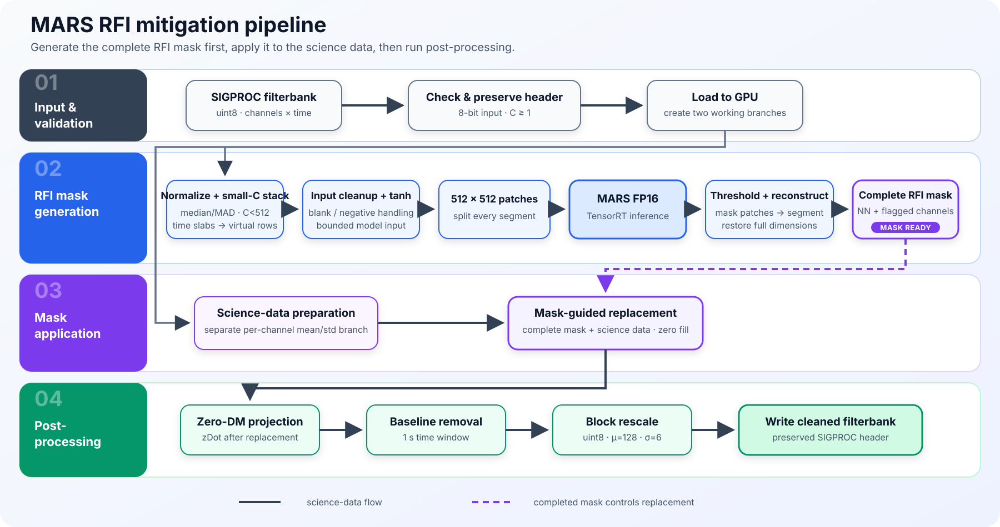
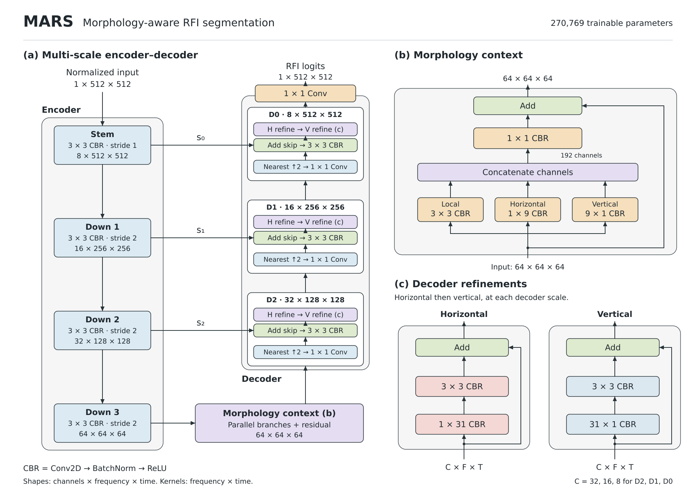

# MARS

This repository accompanies the paper
[MARS: A Lightweight Morphology-Aware RFI Segmentation Network for Mask-Guided Mitigation in Radio Astronomy](https://arxiv.org/abs/2608.05546).

MARS (**M**orphology-**A**ware **R**FI **S**egmentation) removes radio-frequency
interference from 8-bit SIGPROC filterbank observations. The public interface is
one script and one configuration file:

```bash
python mars.py -f input.fil -o output.fil
```

The script predicts an RFI mask, replaces contaminated samples, applies the
configured zero-DM projection and baseline removal, rescales the data, and
writes a cleaned filterbank while preserving the SIGPROC header contract.

## Obtain MARS

The source code and trained checkpoint are publicly available at
[github.com/Haalandspring/MARS](https://github.com/Haalandspring/MARS)
under the [MIT License](LICENSE). Obtain a working copy with:

```bash
git clone https://github.com/Haalandspring/MARS.git
cd MARS
```

The frozen [v0.1.0 release](https://github.com/Haalandspring/MARS/releases/tag/v0.1.0)
is archived on Zenodo with the version-specific DOI
[10.5281/zenodo.22857994](https://doi.org/10.5281/zenodo.22857994).
Use this archived copy when referring to version 0.1.0; the development branch
continues to change.

## Setup

The validated environment is Linux x86-64, Python 3.13, and an NVIDIA GPU with
a driver capable of CUDA 13. Git must also be installed and available on `PATH`,
because `sigpyproc` is installed from a fixed Git commit. With Conda installed,
create a clean environment, then install the exact tested MARS, ONNX, and
TensorRT dependencies:

```bash
conda create -n mars python=3.13 -y
conda activate mars
python -m pip install --upgrade pip wheel
python -m pip install -r requirements.txt
python -m pip check
```

`requirements.txt` installs both execution paths: PyTorch FP16 inference and
ONNX/TensorRT FP16 compilation. Direct and transitive package versions are
locked to the clean environment used for the end-to-end checks. Python, Git,
and the NVIDIA hardware and driver must be provided separately; the required
CUDA runtime libraries are installed by the pinned NVIDIA wheels.

The production checkpoint is included in the repository at the location already
selected by `config.json`:

```text
artifacts/checkpoints/mars-paper-historical/best_f1.pt
```

Its SHA-256 is
`3acf3997bd83a8836e512974a2093bce319ede7f47ce3868757df545c4bd69a4`.
The supplied configuration sets `"tensorrt_path": null` and uses the included
PyTorch checkpoint, so the first run does not require a locally compiled
TensorRT engine. After installing the dependencies, run MARS directly from the
repository:

```bash
python mars.py \
  -f /path/to/observation.fil \
  -o /path/to/observation_mars.fil
```

`-f` and `-o` are required. Processing settings are kept in
[`config.json`](config.json); use `-c /path/to/config.json` to select another
configuration. Relative checkpoint and engine paths are resolved from the
MARS repository directory, including when using a custom configuration.
`--baseline-streaming` and `--baseline-streaming-workspace-mb` control baseline
memory use for a particular run. See `python mars.py --help` for all options.

If `-o` ends in `.fil`, it is used as the output filename. Otherwise it is
treated as an output directory:

```bash
python mars.py -f observation.fil -o cleaned/
```

This writes `cleaned/observation_mars.fil`.

## Configuration

Edit `config.json` before running. Important options include:

| Setting | Purpose |
| --- | --- |
| `checkpoint` | PyTorch checkpoint used when `tensorrt_path` is `null`. |
| `tensorrt_path` | Verified TensorRT engine; set to `null` for PyTorch. |
| `batch_size` | Patch inference batch size. |
| `threshold` | Binary RFI-mask threshold. |
| `target_segment_seconds` | Requested normalization-segment duration. |
| `small_channel_packing_enabled` | Stack time slabs along frequency when `C < 512`. |
| `raw_compute_dtype` | Pre/post-processing precision; default `float16`. |
| `hys_enabled` | Enable or disable mask hysteresis. |
| `segment_channel_flag_ratio` | Mask-occupancy fraction that flags a channel within a segment. |
| `science_zdot` | Enable the zero-DM projection. |
| `science_zdot_stage` | Apply `zdot` before or after replacement. |
| `replacement_fill_mode` | Replacement strategy for masked samples. |
| `final_baseline_enabled` | Enable final baseline removal. |
| `baseline_width` | Baseline width in seconds. |
| `rescale_mode` | Output rescaling method. |
| `write_mask_files` | Optionally write diagnostic mask filterbanks. |

The supplied production configuration uses PyTorch FP16 inference and the
validated low-FP mitigation profile: 4 s normalization segments, a
0.15 segment-channel flag ratio, mild hysteresis, local-Gaussian replacement
at unit clean-noise scale, post-replacement `zdot`, baseline removal, and
Filtool-style block rescaling.

To use the same bounded-memory baseline path as the validation batch, add
`--baseline-streaming`; its configured workspace is 4096 MiB. Streaming is
numerically equivalent to the one-shot running median and only changes memory
use and runtime.

### TensorRT FP16

TensorRT cannot run the `.pt` checkpoint directly. **Before enabling TensorRT,
first compile and verify an engine on the machine that will run MARS.** The
included checkpoint is used automatically.

After installing `requirements.txt`, compile on the deployment GPU:

```bash
python compile_tensorrt.py
```

`compile_tensorrt.py` reads `checkpoint`, `batch_size`, `patch_size`, and the
`tensorrt_build` section from `config.json`. It performs this mandatory sequence:

```text
.pt checkpoint -> ONNX export -> FP16 TensorRT build -> numerical verification
               -> .engine + .engine.json verification sidecar
```

Do not configure the engine until compilation reports that verification passed.
Then set:

```json
"tensorrt_path": "artifacts/tensorrt/mars-fp16.engine"
```

Run the normal interface; no additional TensorRT command-line option is needed:

```bash
python mars.py -f input.fil -o output.fil
```

The engine and its `.engine.json` sidecar must remain together. MARS rejects a
missing, mismatched, failed, or unverified engine instead of silently falling
back to PyTorch. Recompile when the GPU architecture, CUDA/TensorRT versions,
checkpoint, model shape, patch size, or batch size changes. To return to the
PyTorch FP16 path, set `tensorrt_path` back to `null`.

## Processing flow

The diagram shows the supplied `config.json` profile. Separate branches prepare
the neural-network inputs and science samples. Predicted masks are restored to
each segment's native coordinates, combined with channel flags, and applied
during local-Gaussian replacement. Post-replacement zDot, baseline removal,
block rescaling, and filterbank output follow. Reconstruction and replacement
are performed per segment; storing a full-observation mask is optional.
Select the figure to open the full-size SVG.

[](pipeline.svg)

## Model flow

The production model is the paper `TRTShapeUNet512` configuration: four encoder
widths `[8, 16, 32, 64]`, morphology-aware context, additive skip connections,
and horizontal/vertical refinement at every decoder scale. It has 270,769
trainable parameters. The U-shaped diagram makes spatial scales, additive skip
connections, and decoder morphology refinement explicit. The insets expand the
three-branch morphology context and the horizontal and vertical residual
refinements. The network head outputs logits; thresholding and optional
hysteresis are performed by the mitigation pipeline.

[](model.svg)

## Supported inputs

- 8-bit SIGPROC filterbanks;
- one or more frequency channels;
- input and output must be different files; and
- the observation must fit the current GPU-resident working set.

For `C < 512`, MARS keeps the science data in its original coordinates and
rearranges only the model-input branch. It splits the time axis into
`ceil(512 / C)` contiguous slabs, stacks them along frequency, pads the final
network patch when necessary, and reverses the same mapping on the predicted
mask before replacement. For example, `[128, 4000]` becomes `[512, 1000]` for
mask generation and is restored to `[128, 4000]` before the mask is applied.

The current implementation loads the complete observation into the
GPU-resident working set; it is not an out-of-core streaming implementation.

## Repository layout

```text
mars.py                simple RFI mitigation entry point
compile_tensorrt.py    config-driven FP16 TensorRT compiler and verifier
config.json            all user-selectable mitigation options
requirements.txt       runtime dependencies
src/mars_rfi/          minimal runtime and TensorRT implementation
pipeline.svg           full-size mitigation swimlane diagram
model.svg              full-size morphology-aware U-Net diagram
artifacts/checkpoints/mars-paper-historical/best_f1.pt
                       production checkpoint required by mars.py
```

All other directories—including search, training, tests, article validation,
datasets, additional checkpoints, TensorRT binaries, generated filterbanks, and
benchmark results—are local-only and excluded from the public Git repository.

## Citation and license

When using MARS in research, cite the **specific archived software version**
used in the analysis and the
[MARS paper](https://arxiv.org/abs/2608.05546). The software reference should
identify the authors, title, version, Zenodo as the repository, and the
version-specific DOI. A GitHub URL provides access to ongoing development;
the archived version's DOI identifies the frozen software being cited.

[`CITATION.cff`](CITATION.cff) contains the software title, version, full author
names, affiliations, ORCIDs, and the version-specific DOI. It is the metadata
source for GitHub's "Cite this repository" feature and Zenodo's GitHub
integration. Cite this release as:

> Gong, Z., White, J., Roy, J., & Armour, W. (2026).
> MARS: A Lightweight Morphology-Aware RFI Segmentation Network for Mask-Guided Mitigation in Radio Astronomy (v0.1.0) [Software]. Zenodo.
> https://doi.org/10.5281/zenodo.22857994

Download the [BibTeX citation from Zenodo](https://zenodo.org/records/22857994/export/bibtex).

MARS is released under the [MIT License](LICENSE).
