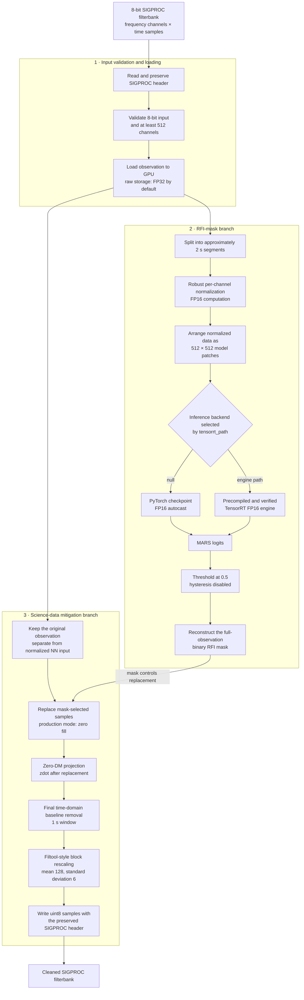
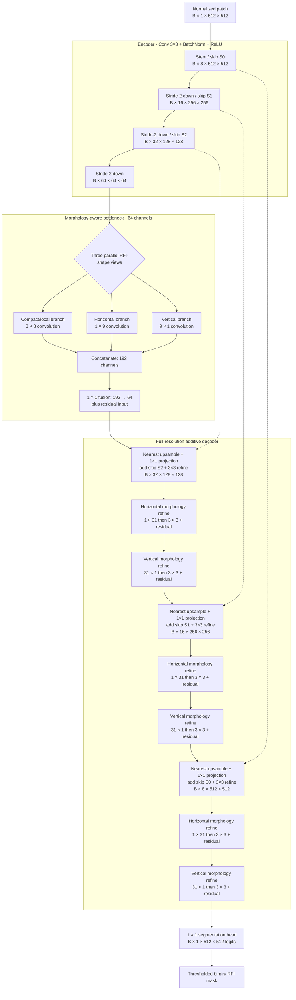

# MARS

MARS (**M**orphology-**A**ware **R**FI **S**egmentation) removes radio-frequency
interference from 8-bit SIGPROC filterbank observations. The public interface is
one script and one configuration file:

```bash
python mars.py -f input.fil -o output.fil
```

The script predicts an RFI mask, replaces contaminated samples, applies the
configured zero-DM projection and baseline removal, rescales the data, and
writes a cleaned filterbank while preserving the SIGPROC header contract.

## Setup

The validated environment is Linux x86-64, Python 3.13, and an NVIDIA GPU with
a driver capable of CUDA 13. Create a clean environment, then install the exact
tested MARS, ONNX, and TensorRT dependencies:

```bash
conda create -n mars python=3.13 -y
conda activate mars
python -m pip install --upgrade pip wheel
python -m pip install -r requirements.txt
```

`requirements.txt` installs both execution paths: PyTorch FP16 inference and
ONNX/TensorRT FP16 compilation. Direct and transitive package versions are
locked to the clean environment used for the end-to-end checks. The system
NVIDIA driver is the only prerequisite that pip cannot install.

The production checkpoint is included in the repository at the location already
selected by `config.json`:

```text
artifacts/checkpoints/mars-paper-historical/best_f1.pt
```

Its SHA-256 is
`3acf3997bd83a8836e512974a2093bce319ede7f47ce3868757df545c4bd69a4`.
After installing the dependencies, run MARS directly from the repository:

```bash
python mars.py \
  -f /path/to/observation.fil \
  -o /path/to/observation_mars.fil
```

Only `-f` and `-o` are command-line options. Every processing option is kept in
[`config.json`](config.json).

If `-o` ends in `.fil`, it is used as the output filename. Otherwise it is
treated as an output directory:

```bash
python mars.py -f observation.fil -o cleaned/
```

This writes `cleaned/observation_mars.fil`.

## Configuration

Edit `config.json` before running. Important options include:

| Setting | Purpose |
| --- | --- |
| `checkpoint` | PyTorch checkpoint used when `tensorrt_path` is `null`. |
| `tensorrt_path` | Verified TensorRT engine; set to `null` for PyTorch. |
| `batch_size` | Patch inference batch size. |
| `threshold` | Binary RFI-mask threshold. |
| `raw_compute_dtype` | Pre/post-processing precision; default `float16`. |
| `hys_enabled` | Enable or disable mask hysteresis. |
| `science_zdot` | Enable the zero-DM projection. |
| `science_zdot_stage` | Apply `zdot` before or after replacement. |
| `replacement_fill_mode` | Replacement strategy for masked samples. |
| `final_baseline_enabled` | Enable final baseline removal. |
| `baseline_width` | Baseline width in seconds. |
| `rescale_mode` | Output rescaling method. |
| `write_mask_files` | Optionally write diagnostic mask filterbanks. |

The supplied production configuration uses FP16 computation, disables
hysteresis, enables `zdot` after RFI replacement, applies baseline removal, and
uses Filtool-style block rescaling.

### TensorRT FP16

TensorRT cannot run the `.pt` checkpoint directly. **Before enabling TensorRT,
first compile and verify an engine on the machine that will run MARS.** The
included checkpoint is used automatically.

After installing `requirements.txt`, compile on the deployment GPU:

```bash
python compile_tensorrt.py
```

`compile_tensorrt.py` reads `checkpoint`, `batch_size`, `patch_size`, and the
`tensorrt_build` section from `config.json`. It performs this mandatory sequence:

```text
.pt checkpoint -> ONNX export -> FP16 TensorRT build -> numerical verification
               -> .engine + .engine.json verification sidecar
```

Do not configure the engine until compilation reports that verification passed.
Then set:

```json
"tensorrt_path": "artifacts/tensorrt/mars-fp16.engine"
```

Run the normal interface; no additional TensorRT command-line option is needed:

```bash
python mars.py -f input.fil -o output.fil
```

The engine and its `.engine.json` sidecar must remain together. MARS rejects a
missing, mismatched, failed, or unverified engine instead of silently falling
back to PyTorch. Recompile when the GPU architecture, CUDA/TensorRT versions,
checkpoint, model shape, patch size, or batch size changes. To return to the
PyTorch FP16 path, set `tensorrt_path` back to `null`.

## Processing flow



## Model flow

The production model is the paper `TRTShapeUNet512` configuration: four encoder
widths `[8, 16, 32, 64]`, morphology-aware context, additive skip connections,
and horizontal/vertical refinement at every decoder scale. It has 270,769
trainable parameters.



## Supported inputs

- 8-bit SIGPROC filterbanks;
- at least 512 frequency channels (`C < 512` is intentionally unsupported);
- input and output must be different files; and
- the observation must fit the current GPU-resident working set.

The current implementation loads the complete observation into the
GPU-resident working set; it is not an out-of-core streaming implementation.

## Repository layout

```text
mars.py                simple RFI mitigation entry point
compile_tensorrt.py    config-driven FP16 TensorRT compiler and verifier
config.json            all user-selectable mitigation options
requirements.txt       runtime dependencies
src/mars_rfi/          minimal runtime and TensorRT implementation
artifacts/checkpoints/mars-paper-historical/best_f1.pt
                       production checkpoint required by mars.py
```

All other directories—including search, training, tests, article validation,
datasets, additional checkpoints, TensorRT binaries, generated filterbanks, and
benchmark results—are local-only and excluded from the public Git repository.

## Citation and license

Citation metadata is provided in [`CITATION.cff`](CITATION.cff). MARS is
released under the [MIT License](LICENSE).
