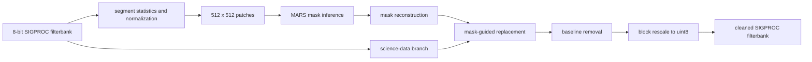
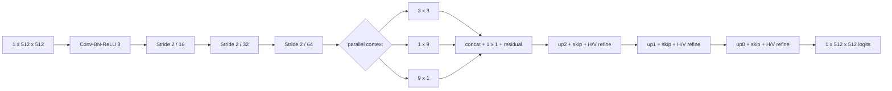

# MARS

MARS is a **M**orphology-**A**ware **R**FI **S**egmentation system for
mask-guided mitigation of radio-astronomy filterbank data. Its primary public
interface is `mars-mitigate`: read an 8-bit SIGPROC filterbank, predict an RFI
mask, replace contaminated samples, remove the baseline, rescale the data, and
write a cleaned filterbank with a validated header/data contract.

The public repository is centered on the reusable mitigation pipeline.
[`search/`](search/README.md) provides an optional real-observation workflow for
mitigation followed by PRESTO and candidate matching. Article-validation tools,
benchmark outputs, datasets, checkpoints, and generated filterbanks are kept out
of the public source tree.

## Quick start

Install the package and the mitigation I/O dependency from the repository root:

```bash
python -m pip install -e ".[mitigation]"
```

Obtain the released MARS checkpoint separately and place it at the path selected
by `configs/pipeline/mitigation.json`. Model binaries are intentionally not
stored in Git. Then mitigate an observation with deterministic PyTorch
inference:

```bash
CUBLAS_WORKSPACE_CONFIG=:4096:8 mars-mitigate \
  --config configs/pipeline/mitigation.json \
  --input-fil observation.fil \
  --output-fil outputs/observation_mars.fil
```

The same validated path is available as a Python API:

```python
from mars_rfi import mitigate_filterbank

timings = mitigate_filterbank(
    "observation.fil",
    "outputs/observation_mars.fil",
    config="configs/pipeline/mitigation.json",
)
```

The input and output paths must differ. The current runtime intentionally
supports only:

- 8-bit SIGPROC filterbanks;
- at least 512 frequency channels; and
- inputs that fit the current GPU-resident working set.

`C < 512` is rejected explicitly and cannot be enabled by lowering a config
value.

## Mitigation data flow



The neural-network mask and science-data branch are kept separate: robust
normalization is used to expose RFI morphology to the model, while replacement
and output scaling operate on the science data. Main mitigation defaults use a
0.5 sigmoid threshold, zero replacement, masked output value 128, and no
hysteresis or `zdot` unless a configuration enables them explicitly.

The implementation is segment-wise but not yet out-of-core: it reads the full
observation and keeps its working arrays on the GPU. See
[`docs/limitations.md`](docs/limitations.md) for the operational boundaries.

## Model

The default MARS network is a lightweight additive U-Net with channels
`(8, 16, 32, 64)`. It combines `3x3`, `1x9`, and `9x1` bottleneck context with
horizontal and vertical refinement at all three decoder scales.



`build_paper_model()` and the locked configs assert 270,769 trainable
parameters. Checkpoints carry an experiment ID, artifact role, and canonical
training fingerprint so a topology-identical ablation cannot be loaded as the
selected mitigation model.

The expected artifact layout is documented in
[`artifacts/README.md`](artifacts/README.md). A typical local installation uses:

```text
artifacts/checkpoints/mars-paper-historical/
  best_f1.pt             # MARS checkpoint used by mars-mitigate
```

## Core commands

| Command | Purpose |
| --- | --- |
| `mars-mitigate` | Apply mask-guided RFI mitigation to an 8-bit `.fil` file. |
| `mars-train` | Train the MARS segmentation model from prepared patch/mask arrays. |
| `mars-export-tensorrt` | Build and numerically verify an ONNX/TensorRT deployment artifact. |
| `mars-diagnostics` | Inspect preprocessing, masks, and residual patches for one observation. |

Advanced mitigation values can be supplied by JSON config or with `--set
KEY=JSON`. Use `mars-mitigate --help` for the full public CLI. An explicitly
requested checkpoint or TensorRT engine is never silently substituted.

### Deterministic science inference

The science configurations set `deterministic_inference=true` and seed 1234.
They disable cuDNN autotuning, require deterministic PyTorch algorithms, and
use a deterministic value-only CUDA median implementation. Set
`CUBLAS_WORKSPACE_CONFIG=:4096:8` before starting Python, as in the quick-start
command.

Byte-identical output is only promised for the same input, checkpoint,
configuration, GPU, and PyTorch/CUDA/cuDNN stack. PyTorch flags do not control
the internal kernels of a TensorRT engine. Performance-oriented runs can disable
strict determinism explicitly.

## Train a model

Training arrays are described in [`data/README.md`](data/README.md). After they
are available at the configured paths:

```bash
mars-train --config configs/train/mars.json
```

The training command validates architecture, loss, data, and artifact identity
fields before writing a checkpoint.

## TensorRT deployment

TensorRT is an optional, machine-specific deployment backend. Install the ONNX
dependencies and build on the target GPU/software stack:

```bash
python -m pip install -e ".[mitigation,onnx]"

mars-export-tensorrt \
  --checkpoint artifacts/checkpoints/mars-paper-historical/best_f1.pt \
  --batch-size 64 --precision fp16 --io-dtype fp16
```

The exporter writes a sidecar containing checkpoint and engine SHA-256 values,
the complete model identity, the build environment, and numerical
PyTorch/TensorRT verification. A missing, mismatched, or unverified sidecar is
an error for validated artifacts.

## Diagnostics

Patch-level visual diagnostics are optional and do not participate in the
mitigation output path:

```bash
python -m pip install -e ".[mitigation,plots]"

mars-diagnostics \
  --input-fil observation.fil \
  --checkpoint artifacts/checkpoints/mars-paper-historical/best_f1.pt \
  --output-dir outputs/diagnostics
```

## Optional real-data search

For an observation that needs RFI mitigation and a pulsar search, start here:

```text
search/
```

It provides three descriptive scripts: `mitigate_rfi.py`, `run_presto.py`, and
`match_candidates.py`. The reusable implementations remain in `src/mars_rfi/`
so command-line and Python users run the same code. See the
[`search` guide](search/README.md) for usage.

## Repository layout

The enforced dependency rule and module ownership are described in
[`docs/code-organization.md`](docs/code-organization.md).

```text
search/                         easy real-observation entry points
src/mars_rfi/                   reusable model, training and mitigation code
src/mars_rfi/search/            PRESTO and candidate-matching implementation
configs/                        normal training and mitigation profiles
tests/search/                   operational-search tests
data/                           local input contract; generated data are ignored
artifacts/                      checkpoints and local TensorRT artifacts
docs/                           code organization and runtime limitations
```

## Development

```bash
python -m pip install -e ".[mitigation,plots,test]"
pytest -q
ruff check .
```

The repository deliberately does not commit generated `.fil`, `.npy`, `.pt`,
ONNX, TensorRT binaries, datasets, benchmark outputs, or private
article-validation code. Model artifacts should be distributed separately with
hashes, producer versions, and access terms.

## Citation and license

Citation metadata is provided in [`CITATION.cff`](CITATION.cff). MARS is
released under the [MIT License](LICENSE).
