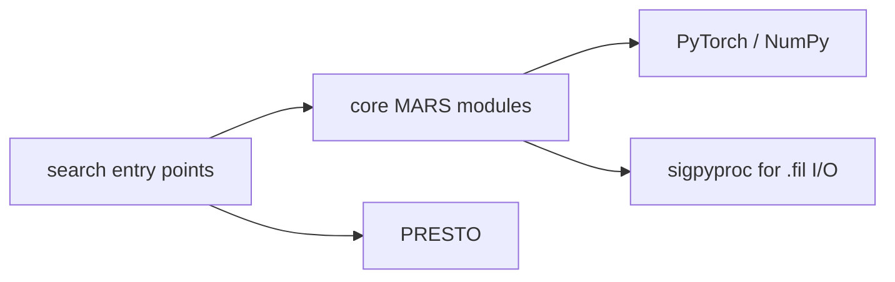

# Code organization

MARS exposes a reusable mitigation implementation and an optional operational
search workflow. The dependency direction is one-way:

Core modules must never import `mars_rfi.search`. Search helpers call the public
or validated internal interfaces of the core pipeline.

## Core package

The files directly under `src/mars_rfi/` implement the reusable system:

- `model.py`: network definitions and model construction;
- `pipeline.py`: end-to-end mask-guided mitigation;
- `mitigate.py`: the public mitigation CLI;
- `preprocess.py`: reusable preprocessing helpers;
- `config.py` and `provenance.py`: locked model/artifact identity;
- `training.py`, `dataset.py`, `augment.py`, and `losses.py`: model training;
- `export_tensorrt.py`: deployment export and verification; and
- `diagnostics.py`: observation-level development diagnostics.

The primary user journey is install → provide checkpoint or verified TensorRT
engine → run `mars-mitigate` → receive a valid cleaned filterbank.

## Operational search

`search/` is the place a user should open for real observations. Its three
scripts expose RFI mitigation, PRESTO execution, and candidate matching. The
implementation of the latter two lives in `src/mars_rfi/search/`; mitigation
continues to use the same public `mars_rfi.mitigate` implementation as
`mars-mitigate`.

Operational commands use the `mars-search-*` prefix. Tests live under
`tests/search/`.

## Configuration boundary

`configs/pipeline/` and `configs/train/` drive the normal model lifecycle. A
benchmark or private validation configuration must not be required for ordinary
mitigation or a normal PRESTO search.

Private article validation remains a separate local workspace and is excluded
by `.gitignore`; it is not imported by the public runtime.
